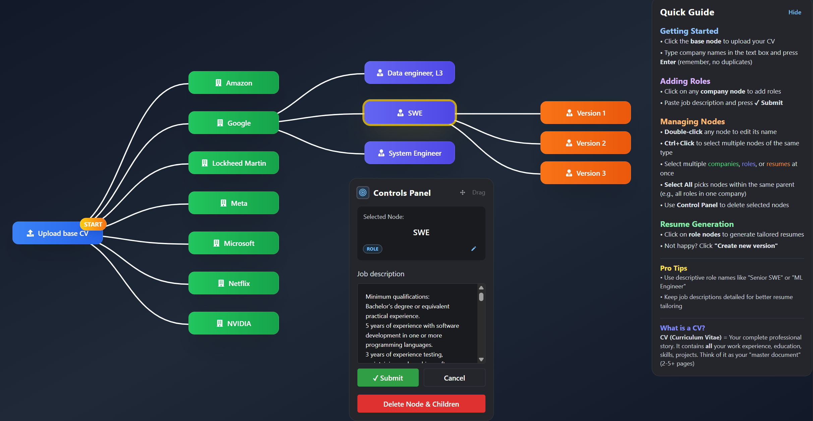

# Resume Management System (RMS)

A modern, interactive resume management platform that transforms how job seekers organize and tailor their applications. Built with a visual, graph-based interface that makes managing multiple job applications intuitive and efficient.



## 🎯 Project Overview

RMS is an innovative approach to resume management that combines:
- **Visual Organization**: Interactive graph interface for managing companies and job opportunities
- **Smart CV Management**: Upload once, tailor intelligently for multiple positions
- **AI-Powered Tailoring**: Generate customized resumes based on company and role requirements
- **Streamlined Workflow**: From CV upload to tailored resume generation in just a few clicks

### 👥 Team Members
- [Ye Chan Lin](https://github.com/yechanlin)
- [Gaurav Kumar](https://github.com/Gaurav12058) 
- [Don D. Le](https://github.com/hilbertcube)
- [Johnny Duong](https://github.com/JohnnyD05)

### 💡 Why RMS?

Traditional resume builders force users through complicated wizards and template selections when job seekers just want something simple and effective. Most tools focus on creating resumes from scratch rather than managing what you already have.

**RMS is different:**
- **Management First**: Organize your base CV and systematically tailor it for specific roles
- **Visual Organization**: See all your target companies and positions in one interactive view
- **Smart Tailoring**: Let AI handle the intelligent customization based on job requirements
- **One Master Document**: Upload once, generate focused variations as needed

### 🔗 Project Links
- [DevPost](https://devpost.com/software/rms-resume-management-system?ref_content=user-portfolio&ref_feature=in_progress)
- [Demo Video](https://www.youtube.com/watch?v=Zsg2mRJl0GA)
- [GitHub Repository](https://github.com/yechanlin/RMS)

## 🏗️ Architecture

```
RMS/
├── 📂 backend/              # Django REST API Server
│   ├── accounts/            # User authentication & management
│   ├── companies/           # Company data models & APIs
│   ├── jobs/               # Job posting models & APIs  
│   ├── resumes/            # CV/Resume processing & storage
│   ├── media/              # File uploads (CVs, generated resumes)
│   ├── resumebuilder/      # Django project settings
│   ├── requirements.txt    # Python dependencies
│   └── manage.py          # Django management script
├── 📂 frontend/            # React.js Web Application
│   ├── src/
│   │   ├── components/     # UI Components
│   │   ├── services/       # API communication
│   │   └── App.tsx        # Main application component
│   ├── package.json       # Node.js dependencies
│   └── tailwind.config.js # Styling configuration
├── 📂 scripts/            # Setup & deployment scripts
│   ├── setup_windows.ps1     # Windows environment setup
│   ├── start_servers_windows.ps1  # Windows development server launcher
│   └── start_servers.sh       # Unix development server launcher
├── 📂 images/              # Documentation assets
├──  LICENSE                # License
└──  README.md              # Project documentation
```


## 🛠️ Tech Stack

### Frontend Technologies
- **React 18** - Modern UI framework with hooks and concurrent features
- **TypeScript** - Type-safe JavaScript for better development experience
- **Tailwind CSS** - Utility-first CSS framework for rapid styling
- **Mantine UI** - Professional React components library
- **React Flow** - Interactive graph visualization and manipulation
- **Framer Motion** - Smooth animations and transitions
- **React Hook Form** - Performant form handling with validation
- **Axios** - HTTP client for API communication
- **Lucide Icons** - Beautiful, customizable icon library

### Backend Technologies
- **Django 4.2** - Robust Python web framework
- **Django REST Framework** - Powerful API development toolkit
- **SQLite** - Lightweight database for development (PostgreSQL ready)
- **PyPDF2 & pdfplumber** - Comprehensive PDF text extraction
- **ReportLab** - PDF generation and manipulation
- **OpenAI API** - GPT integration for resume tailoring
- **Pillow** - Image processing capabilities
- **Celery + Redis** - Background task processing (optional)
- **Gunicorn + WhiteNoise** - Production deployment ready

### Development & Deployment
- **CORS Headers** - Cross-origin resource sharing configuration
- **Django Debug Toolbar** - Development debugging tools
- **Python Decouple** - Environment configuration management
- **PowerShell Scripts** - Windows automation and setup tools

## 🚀 Getting Started

### Prerequisites
- **Python 3.9+** - Backend development
- **Node.js 16+** - Frontend development  
- **Git** - Version control
- **PowerShell** (Windows) or **Bash** (Unix) - Script execution

### 🎯 Quick Start (Recommended)

#### For Windows Users:
```powershell
# Clone the repository
git clone https://github.com/yechanlin/RMS.git
cd RMS

# One-time setup (installs dependencies, creates virtual environment)
.\scripts\setup_windows.ps1

# Start both servers
.\scripts\start_servers_windows.ps1
```

#### For Unix/Linux/Mac Users:
```bash
# Clone the repository
git clone https://github.com/yechanlin/RMS.git
cd RMS

# Start both servers (auto-setup included)
./scripts/start_servers.sh
```

**This will automatically:**
- ✅ Install all Python and Node.js dependencies
- ✅ Create and activate Python virtual environment
- ✅ Run database migrations
- ✅ Start Django backend on `http://localhost:8000`
- ✅ Start React frontend on `http://localhost:3000`

### 🔧 Manual Setup (Development)

<details>
<summary>Click to expand manual setup instructions</summary>

#### Backend Setup
```bash
cd backend

# Create and activate virtual environment
python -m venv venv
# Windows:
.\venv\Scripts\activate
# Unix/Mac:
source venv/bin/activate

# Install dependencies
pip install -r requirements.txt

# Setup environment variables
cp env.example .env
# Edit .env file to add your API keys

# Run migrations
python manage.py migrate

# Start Django server
python manage.py runserver 8000
```

#### Frontend Setup
```bash
cd frontend

# Install dependencies
npm install

# Start React development server
npm start
```

</details>

### 🔑 Environment Configuration

Create a `.env` file in the `backend/` directory:
```env
# AI API Keys (choose one or both)
OPENAI_API_KEY=your_openai_api_key_here
ANTHROPIC_API_KEY=your_anthropic_api_key_here

# Django Settings
SECRET_KEY=your_django_secret_key
DEBUG=True
```

### 🌐 Access Points
- **Frontend Application**: `http://localhost:3000`
- **Backend API**: `http://localhost:8000`
- **API Documentation**: `http://localhost:8000/api/`
- **Django Admin**: `http://localhost:8000/admin/`

## ✨ Features & Functionality

### 🎨 Interactive Visual Interface
- **Node-Based Graph**: Intuitive drag-and-drop interface for managing companies and jobs
- **Real-Time Updates**: All changes sync instantly with the backend database
- **Smart Layout**: Automatic node positioning with manual adjustment capabilities
- **Visual Relationships**: Clear connections between companies and their job openings

### 📄 CV Management System
- **Multi-Format Support**: Upload PDF, DOC, DOCX, or TXT files
- **Text Extraction**: Automatic content parsing from uploaded documents
- **Version Control**: Track different versions of your base CV
- **File Management**: Secure storage with organized file structure

### 🏢 Company & Job Organization
- **Company Profiles**: Store company information, descriptions, and multiple job openings
- **Job Details**: Comprehensive job descriptions, requirements, and application status
- **Bulk Operations**: Create, edit, and delete multiple entries efficiently
- **Search & Filter**: Quickly find specific companies or positions

### 🤖 AI-Powered Resume Tailoring
- **OpenAI Integration**: GPT-powered resume customization
- **Anthropic Claude**: Alternative AI provider for diverse output styles
- **Context-Aware Generation**: Tailors content based on specific job requirements
- **Intelligent Formatting**: Maintains professional resume structure and formatting

### 💾 Data Management
- **Persistent Storage**: SQLite database with PostgreSQL production support
- **File Organization**: Structured media storage for CVs and generated resumes
- **Backup Ready**: Easy data export and migration capabilities
- **RESTful APIs**: Clean, documented API endpoints for all operations

## � Development Status & Roadmap

### ✅ Completed Features

#### Backend Infrastructure
- **Complete Django REST API** with full CRUD operations
- **Database Models**: Companies, Jobs, BaseCV, and TailoredResume models
- **File Upload System**: Secure CV upload with validation and storage
- **PDF Processing**: Text extraction from uploaded documents
- **API Documentation**: Well-structured RESTful endpoints
- **Database Migrations**: Full schema with relationship integrity

#### Frontend Application  
- **Interactive Graph Interface** using React Flow
- **Modern UI Components** with Mantine and Tailwind CSS
- **Real-Time Synchronization** between frontend and backend
- **File Upload Interface** with drag-and-drop functionality
- **Responsive Design** optimized for various screen sizes
- **Error Handling & Loading States** for smooth user experience

#### Integration & DevOps
- **Cross-Platform Scripts** for Windows and Unix environments
- **Automated Setup** with one-command installation
- **Development Workflow** with hot-reload and debugging tools
- **CORS Configuration** for seamless frontend-backend communication

### 🔄 Current Development Phase

#### AI Resume Generation (In Progress)
- **OpenAI API Integration**: Connected and ready for resume tailoring
- **Anthropic Claude Support**: Alternative AI provider configured
- **Content Processing Pipeline**: Framework for intelligent text generation
- **Template System**: Structure for maintaining resume formatting

### 🎯 Upcoming Features

#### Phase 1: AI Enhancement
- [ ] **Smart Resume Tailoring**: AI-generated content based on job descriptions
- [ ] **Multiple AI Providers**: OpenAI and Anthropic integration with fallback
- [ ] **Content Optimization**: Industry-specific keyword optimization
- [ ] **A/B Testing**: Compare different AI-generated versions

#### Phase 2: Advanced Features
- [ ] **User Authentication**: Secure login and personal data management
- [ ] **Application Tracking**: Monitor job application status and deadlines
- [ ] **Template Library**: Multiple resume formats and styles
- [ ] **Analytics Dashboard**: Track application success rates

#### Phase 3: Production Ready
- [ ] **PostgreSQL Migration**: Production database configuration
- [ ] **Cloud Deployment**: AWS/GCP deployment scripts
- [ ] **Performance Optimization**: Caching and background task processing
- [ ] **Mobile Responsiveness**: Enhanced mobile and tablet experience

### 📈 API Endpoints (Production Ready)

#### Company Management
- `GET /api/companies/` - List all companies
- `POST /api/companies/` - Create new company
- `PUT /api/companies/{id}/` - Update company details
- `DELETE /api/companies/{id}/` - Remove company
- `GET /api/companies/{id}/` - Get specific company details

#### Job Management  
- `GET /api/jobs/` - List all job positions
- `POST /api/jobs/` - Create new job posting
- `PUT /api/jobs/{id}/` - Update job details
- `DELETE /api/jobs/{id}/` - Remove job posting
- `GET /api/jobs/by_company/?company_id={id}` - Filter jobs by company

#### Resume & CV Management
- `POST /api/resumes/base-cv/upload/` - Upload new CV file
- `GET /api/resumes/base-cv/latest/` - Retrieve most recent CV
- `GET /api/resumes/base-cv/{id}/download/` - Download CV file
- `POST /api/resumes/tailor/` - Generate tailored resume (coming soon)

#### Tailored Resume Generation
- `POST /api/resumes/generate/` - Create AI-tailored resume
- `GET /api/resumes/tailored/{id}/` - Retrieve generated resume
- `GET /api/resumes/tailored/by_job/{job_id}/` - Get resumes for specific job

## 🤝 Contributing

We welcome contributions from developers of all skill levels! Here's how you can help improve RMS:

### 🔧 Development Workflow
1. **Fork the repository** and create your feature branch:
   ```bash
   git checkout -b feature/amazing-new-feature
   ```

2. **Set up your development environment**:
   ```bash
   # Use our setup scripts for quick start
   .\scripts\setup_windows.ps1  # Windows
   ./scripts/start_servers.sh   # Unix/Mac
   ```

3. **Make your changes** following our coding standards:
   - **Backend**: Follow PEP 8 for Python code
   - **Frontend**: Use TypeScript and follow React best practices
   - **Comments**: Write clear, descriptive comments
   - **Testing**: Add tests for new functionality

4. **Test your changes**:
   ```bash
   # Backend tests
   cd backend && python manage.py test
   
   # Frontend tests  
   cd frontend && npm test
   ```

5. **Commit and push your changes**:
   ```bash
   git commit -m "Add amazing new feature"
   git push origin feature/amazing-new-feature
   ```

6. **Submit a Pull Request** with a clear description of your changes

### 🎯 Areas for Contribution
- **AI Integration**: Enhance resume tailoring algorithms
- **UI/UX Improvements**: Make the interface more intuitive
- **Performance Optimization**: Database queries and frontend rendering
- **Testing**: Unit tests, integration tests, and end-to-end testing
- **Documentation**: API docs, user guides, and code comments
- **Bug Fixes**: Check our Issues tab for reported bugs

### 📝 Code Style Guidelines
- **Python**: Black formatter, flake8 linter
- **JavaScript/TypeScript**: Prettier formatter, ESLint
- **Git Commits**: Use conventional commit messages
- **Documentation**: Update README and API docs for new features

## 📋 Testing

### Backend Testing
```bash
cd backend
python manage.py test
python manage.py test resumes.tests  # Specific app tests
```

### Frontend Testing
```bash
cd frontend
npm test                    # Run all tests
npm test -- --coverage     # Run with coverage report
```

## 🚀 Deployment

### Development Deployment
Use the provided scripts for local development:
```bash
# Windows
.\scripts\start_servers_windows.ps1

# Unix/Mac  
./scripts/start_servers.sh
```

### Production Deployment
1. **Set up environment variables** in `.env` file
2. **Configure PostgreSQL** database (optional, SQLite works for small scale)
3. **Collect static files**: `python manage.py collectstatic`
4. **Use production server**: Gunicorn + Nginx configuration included
5. **Deploy frontend**: `npm run build` for optimized React build

## 📄 License

This project is licensed under the **MIT License** - see the [LICENSE](LICENSE) file for details.

### MIT License Summary
- ✅ **Commercial use** allowed
- ✅ **Modification** allowed  
- ✅ **Distribution** allowed
- ✅ **Private use** allowed
- ❌ **Liability** not provided
- ❌ **Warranty** not provided

## 🙏 Acknowledgments

- **React Flow** team for the excellent graph visualization library
- **Django REST Framework** community for robust API development tools
- **Mantine** team for beautiful, accessible UI components
- **OpenAI & Anthropic** for powerful AI text generation capabilities
- **Tailwind CSS** for making styling fast and consistent

## 📞 Support & Contact

- **GitHub Issues**: [Report bugs or request features](https://github.com/yechanlin/RMS/issues)
- **Project Lead**: [Ye Chan Lin](https://github.com/yechanlin)
- **Email**: Contact through GitHub profiles
- **Documentation**: Check our [Wiki](https://github.com/yechanlin/RMS/wiki) for detailed guides

---

<div align="center">

**Built with ❤️ by the RMS Team**

[⭐ Star this repo](https://github.com/yechanlin/RMS) | [🐛 Report Bug](https://github.com/yechanlin/RMS/issues) | [💡 Request Feature](https://github.com/yechanlin/RMS/issues)

</div>