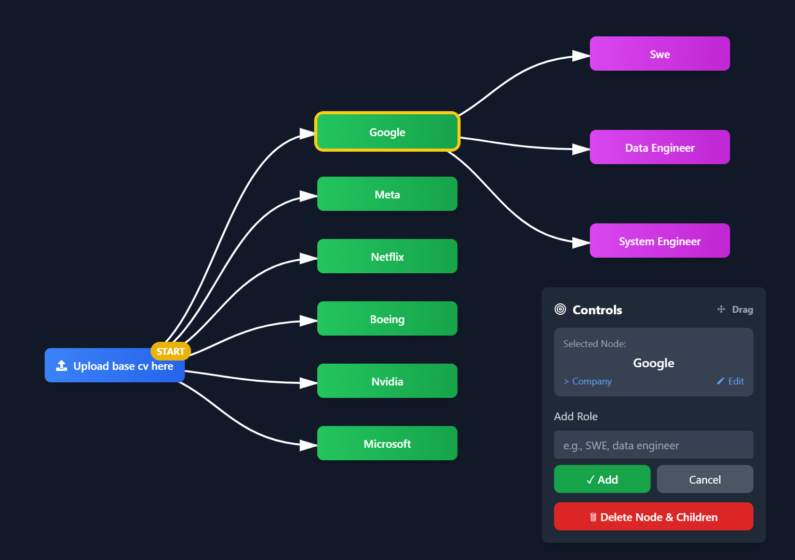

# Resume Management System - Interactive Management System and Generator

An interactive resume builder that allows users to create tailored resumes for different companies and job positions.



## 🎯 Project Overview

This project creates an interactive graph-based interface where users can:
1. Upload a base CV/Resume
2. Add company nodes for target companies
3. Create job-specific nodes with titles and descriptions
4. Generate tailored resumes using AI based on the company and role

## 🏗️ Architecture

```
ResumeBuilder/
├── backend/           # Django REST API
├── frontend/          # React.js application
├── docs/             # Project documentation
└── README.md         # This file
```

## 🛠️ Tech Stack

### Frontend
- **React.js** - UI framework
- **Tailwind CSS** - Styling
- **React Flow** - Graph visualization
- **React Router** - Navigation
- **Axios** - HTTP client

### Backend
- **Django** - Web framework
- **Django REST Framework** - API development
- **SQLite** - Database (prototype) / PostgreSQL (production ready)
- **PyPDF2/pdfplumber** - PDF processing
- **OpenAI/Anthropic** - AI resume generation

## 🚀 Getting Started

### Prerequisites
- Python 3.9+
- Node.js 16+
- No database setup required (SQLite included)

### Quick Start (Recommended)
```bash
# Clone the repository
git clone <repository-url>
cd ResumeBuilder

# Start both servers with one command
./start_servers.sh
```

This will automatically:
- Start the Django backend on `http://localhost:8000`
- Start the React frontend on `http://localhost:3000`
- Run database migrations
- Install dependencies if needed

### Manual Setup

#### Backend Setup
```bash
cd backend
python -m venv venv
source venv/bin/activate  # On Windows: venv\Scripts\activate
pip install -r requirements.txt
python manage.py migrate
python manage.py runserver 8000
```

#### Frontend Setup
```bash
cd frontend
npm install
npm start
```

**Note:** Backend runs on port 8000, frontend on port 3000.

## 👥 Team Structure

- **Backend Developers**: Django API, PDF processing, AI integration
- **Frontend Developers**: React UI, graph visualization, user experience
- **Project Lead**: Full-stack setup and coordination

## 📋 Development Phases

1. **Phase 1**: ✅ Basic project setup and structure
2. **Phase 2**: ✅ Graph visualization and node management
3. **Phase 3**: ✅ Companies and Jobs API endpoints
4. **Phase 4**: 🔄 PDF upload and parsing functionality
5. **Phase 5**: 🔄 AI resume generation
6. **Phase 6**: 🔄 Polish and deployment

## 🎯 Current Status

### ✅ Completed
- **Backend**: Companies and Jobs models with full CRUD APIs
- **Frontend**: Interactive graph interface with node management
- **Database**: SQLite setup with persistent data storage
- **API**: RESTful endpoints for companies and jobs
- **Integration**: Full backend-frontend integration with real-time sync
- **CV Upload**: PDF/DOC file upload and storage functionality

### 🔄 In Progress
- **AI Integration**: Resume generation using company + job data

### 📋 API Endpoints Available
- `GET /api/companies/` - List all companies
- `POST /api/companies/` - Create new company
- `PUT /api/companies/{id}/` - Update company
- `DELETE /api/companies/{id}/` - Delete company
- `GET /api/jobs/` - List all jobs
- `POST /api/jobs/` - Create new job (linked to company)
- `PUT /api/jobs/{id}/` - Update job
- `DELETE /api/jobs/{id}/` - Delete job
- `GET /api/jobs/by_company/?company_id=1` - Jobs for specific company
- `POST /api/resumes/base-cv/upload/` - Upload CV file
- `GET /api/resumes/base-cv/latest/` - Get latest uploaded CV
- `GET /api/resumes/base-cv/{id}/download/` - Download CV file

### 🎮 Frontend Features
- **Interactive Node Graph**: Click to add companies and jobs
- **Real-time Sync**: All changes sync with backend immediately
- **CV Upload**: Drag & drop or click to upload resume files
- **Node Management**: Edit, delete, and organize nodes
- **Loading States**: Visual feedback during API operations
- **Error Handling**: User-friendly error messages

## 🤝 Contributing

1. Fork the repository
2. Create a feature branch
3. Make your changes
4. Submit a pull request

## 📄 License

This project is licensed under the MIT License.